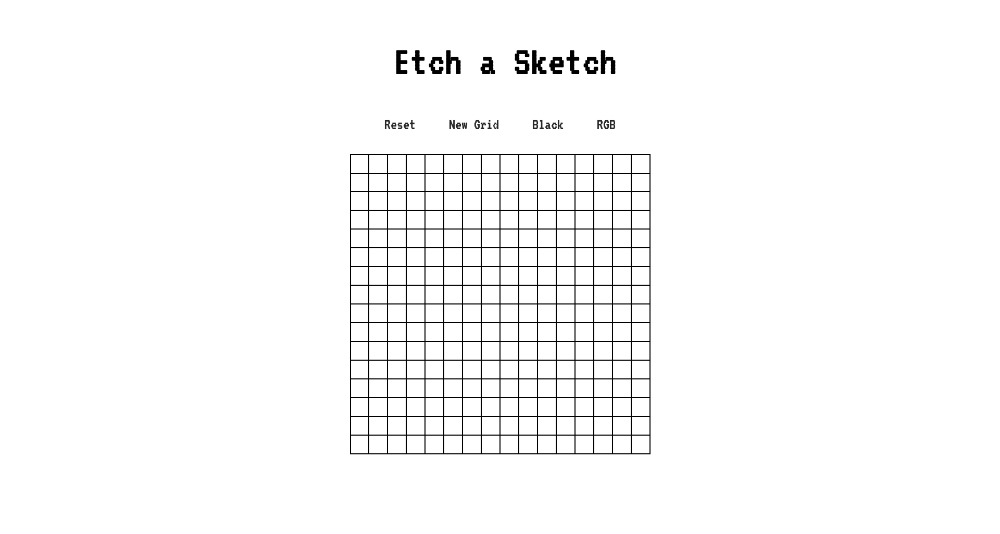
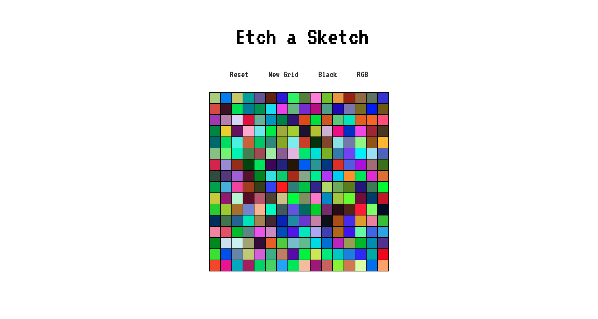
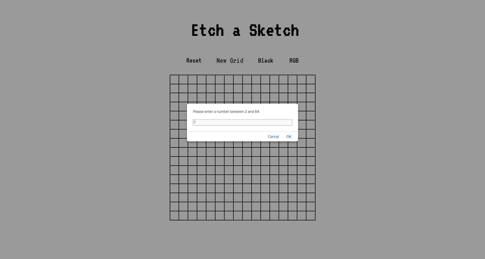
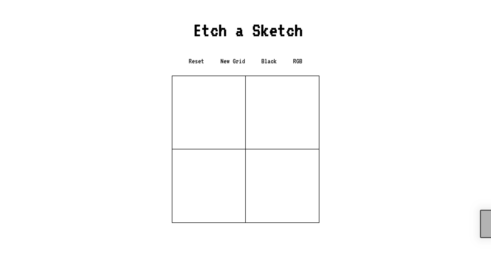

## Screenshot









## New 

CSS &nbsp; ```display: grid``` ```margin: 0 auto``` 

JS &nbsp; ```DOM manipulation``` ```load``` ```prompt``` <a href = "https://www.javascripttutorial.net/dom/manipulating/remove-all-child-nodes/">removeAllChildNodes</a>
